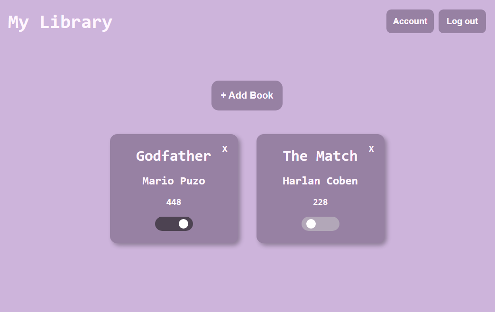

# Library
A digital library that allows users to create an account with google authentication and store their collection of books within Firestore. Users are also allow to create and store their collection of books within their local storage.

Live demo of [The Digital Library](https://vinnybui.github.io/Library/)

## Built With
**Technologies**
- HTML/CSS
- Javascript
- VS Code
- Git and Github
- Firebase (Authentication/Firestore)

## Preview of Project

(<a href="#top">back to top</a>)

## Credit to

Book icons created by Smashicons - Flaticon

Check mark icons created by Maxim Basinski Premium 

Problem icons created by Freepik - Flaticon

Check icons created by kliwir art - Flaticon

Exclamation mark icons created by Flat Icons
